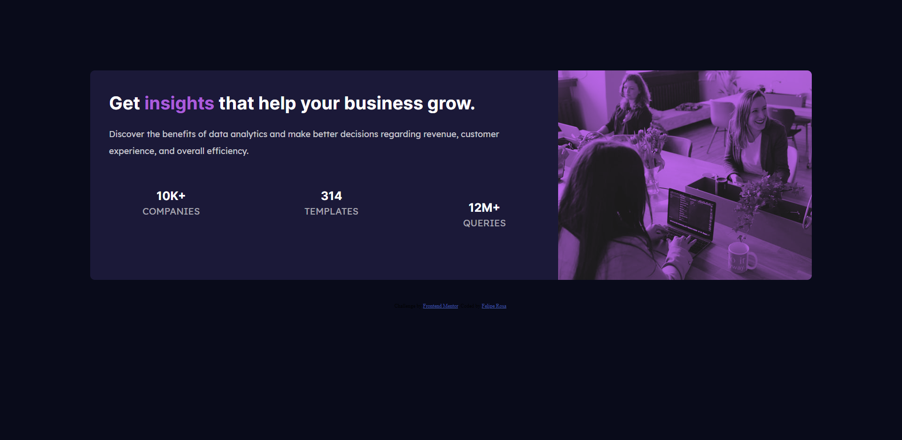

# Frontend Mentor - Stats preview card component solution

This is a solution to the [Stats preview card component challenge on Frontend Mentor](https://www.frontendmentor.io/challenges/stats-preview-card-component-8JqbgoU62). Frontend Mentor challenges help you improve your coding skills by building realistic projects.

## Table of contents

- [Overview](#overview)
  - [The challenge](#the-challenge)
  - [Screenshot](#screenshot)
  - [Links](#links)
- [My process](#my-process)
  - [Built with](#built-with)
  - [What I learned](#what-i-learned)
- [Author](#author)

## Overview

### The challenge

Users should be able to:

- View the optimal layout depending on their device's screen size

### Screenshot

### Links

- Live Site URL: [Add live site URL here](https://felipsrosa.github.io/front-end-challenge-1/)

### Built with

- Semantic HTML5 markup
- CSS custom properties
- Flexbox
- Mobile-first workflow

- proud of this CSS:

  filter: grayscale(50%) brightness(45%) sepia(70%) hue-rotate(-125deg)
  saturate(600%) contrast(0.8);

- Website - [Add your name here](https://www.linkedin.com/in/felipe-s-rosa/)
- Frontend Mentor - [@yourusername](https://www.frontendmentor.io/profile/felipsrosa)
